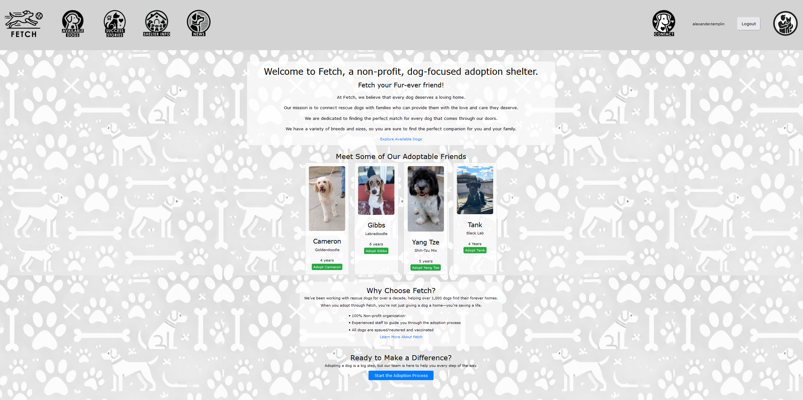

# Fetch
## Table of Contents    
+ [Overview](#overview)
+ [Architecture](#architecture)

## Overview
Fetch is a web app made using C#/.NET Framework and blazor web app. The purpose of Fetch is to 
connect potenial dog adopters with local shelters to find them the right match.

